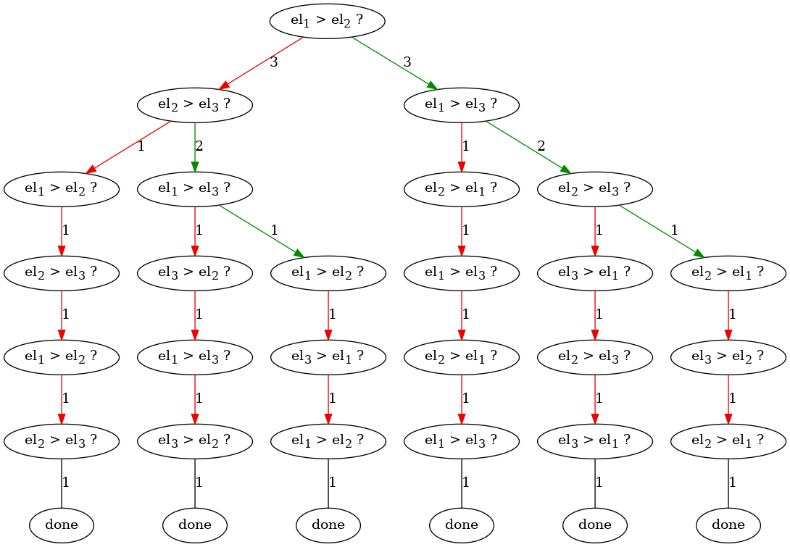
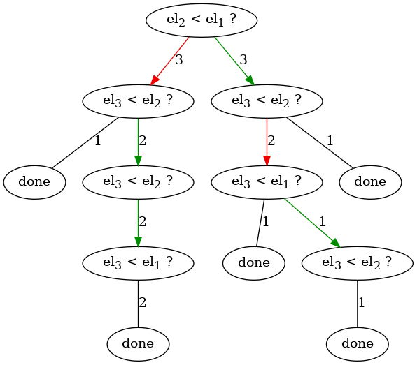

Домашнее задание про сортировки

В домашней работе вам предстоит проиллюстрировать теорему об асимптотике сортировок сравнением.
Ваша задача -- сочинить механизм, способный получить `сортировку` (функцию, например `sorted` в питоне) и `длину_коллекции` (число) и построить дерево сравнений переданной сортировки для коллекции заданной длины.

Дерево сравнений сортировки устроено следующим образом.
Узлы дерева -- операции, указывающие, какие сейчас элементы сравниваются. 
От вершины может исходить ветвь к дочерней вершине, показывающей, какие затем сравниваются элементы при *том* или *ином* результате сравнения.

Например, ниже представлены два дерева сравнений: для `bubble sort` и функции `sorted` (нижняя иллюстрация) питона на последовательностях длины 3.

## дерево сравнений bubble sort


## дерево сравнений sorted


### описание дерева сравнений sorted
Известно, что всего разных последовательностей длины 3 можно вообразить шесть: 
```
(0, 1, 2), (0, 2, 1), (1, 0, 2), 
(1, 2, 0), (2, 0, 1), (2, 1, 0)
```
Какая бы из таких последовательностей ни поступила на вход в sorted, сначала, сравниваются второй и первый элементы.  
Вне зависимости от сравнения (хотя в трёх случаях в этом сравнении побеждает один элемент, а в трёх -- другой ) затем сравниваются третий и второй элементы.
