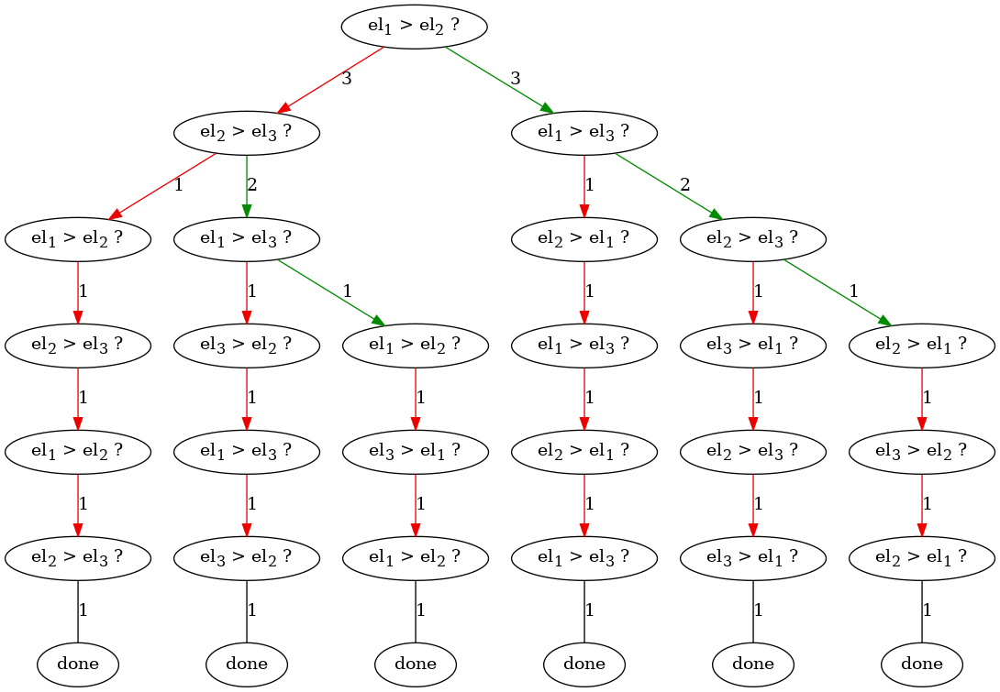

# Домашнее задание про сортировки

В домашней работе вам предстоит проиллюстрировать основную идею теоремы об асимптотике сортировок сравнением -- дерево сравнений.

Дерево сравнений сортировки устроено следующим образом.
Узлы дерева -- операции, указывающие, какие сейчас элементы сравниваются. 
От вершины может исходить ветвь к дочерней вершине, показывающей, какие затем сравниваются элементы при *том* или *ином* результате сравнения.

Например, ниже представлены два дерева сравнений: для `bubble sort` и функции `sorted` (нижняя иллюстрация) питона на последовательностях длины 3.

## дерево сравнений bubble sort


## дерево сравнений sorted


### описание дерева сравнений sorted
Известно, что всего разных последовательностей длины 3 можно вообразить шесть: 
```
(0, 1, 2), (0, 2, 1), (1, 0, 2), 
(1, 2, 0), (2, 0, 1), (2, 1, 0)
```
Какая бы из таких последовательностей ни поступила на вход в sorted, сначала, сравниваются второй и первый элементы.  
Вне зависимости от сравнения (хотя в трёх случаях в этом сравнении побеждает один элемент, а в трёх -- другой ) затем сравниваются третий и второй элементы.  
Иногда после этого сортировка больше не производит сравнений, а иногда -- делает ещё пару.

В конце концов, любой путь от корня до листа в таком дереве соответствует истории того, как сортировка вела себя на каком-то определённом входе.

## Формальная постановка задачи
Ваша задача -- сочинить механизм, способный получить `сортировку` (функцию, например `sorted` в питоне) и `длину_коллекции` (число) и построить дерево сравнений переданной сортировки для коллекции заданной длины.

Дерево сравнений для сортировки нужно получить эмпирически: поставив эксперименты по упорядочиванию всех возможных последовательностей переданной длины.  
Обратите внимание на то, что ваша функция не может модифицировать код переданной сортировки, так как получает объект.

### Подзадачи
1. сочинить предложенный механизм логирования асимптотики сортировок
2. реализовать запись дерева сортировки в файл в формате `dot`. (см приложенный [`sorted_3.dot`](sorted_3.dot), описывающий файл, из которого получена иллюстрация работы sorted командой `dot -Tpng sorted_3.dot > res3_sorted.png`
3. взять три сортировки на питоне -- sorted, упомянутую в курсе, любую ещё одну  -- и провести эксперимент по оценке асимптотики выбранных сортировок на последовательностях длины 3, 4, 5.

## Советы
Для записи деревьев и графов разработан открытый [язык *dot*](https://www.graphviz.org/pdf/dotguide.pdf). С ним умеет работать [GraphViz](https://www.graphviz.org/about/). Упомянутая выше программа `dot` -- часть GraphViz. Авторы задачи убеждены в адекватности работы dot в linux, колабе и wsl, но не исследовани поведение на других ОС.

Обратите внимание на возможность сочинить свою операцию сравнения
